# TRYHACKME: LIAN YU

### Scanning the IP

```
nmap 10.48.171.131
```
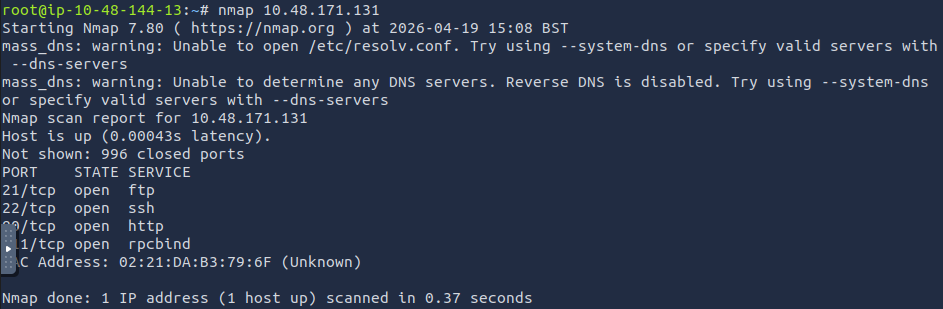

> Port found: <br>
> port 21/tcp - ftp <br> 
> port 22/tcp - ssh <br>
> port 80/tcp - httpd <br>
> port 111/tcp - rpcbind <br>

### Enumeration

```
Visit the IP
```

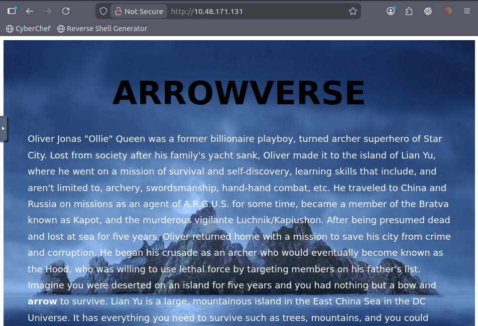

> Found a page of Arrowverse <br>

> Run gobuster for hidden directories <br>

```
gobuster dir -u http://10.48.171.131 --wordlist /usr/share/wordlists/dirbuster/directory-list-2.3-small.txt
```

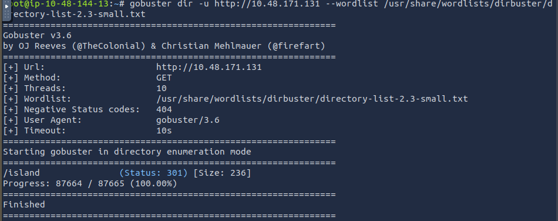

> Found a directory which is /island <br>
> Visit http://10.48.171.131/island/ <br>

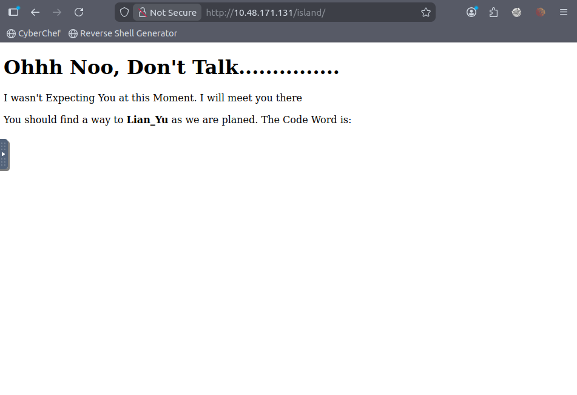

> The page said about a code word. <br>
> View the page source. <br>

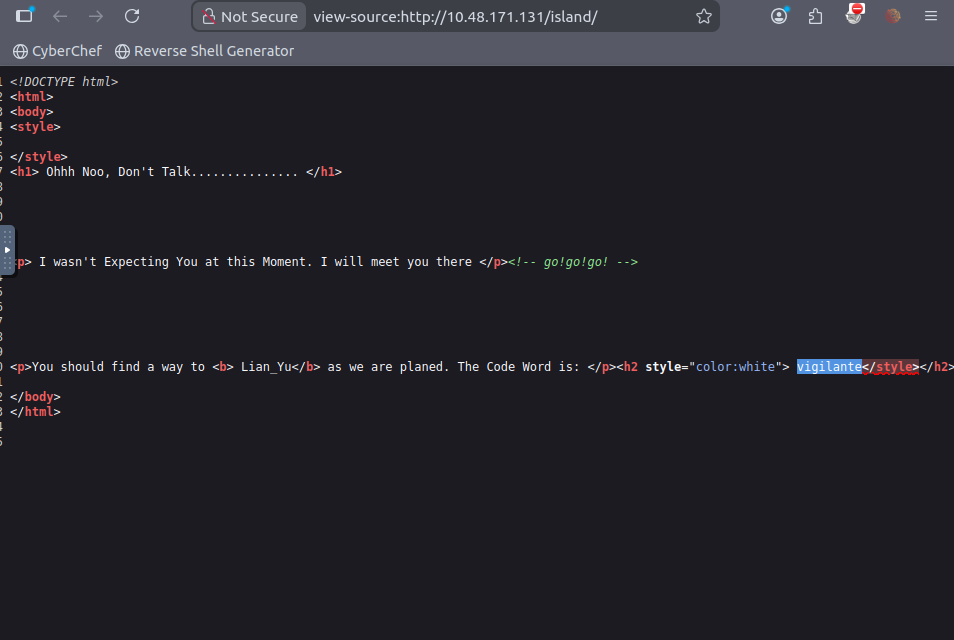

> Discovered the code word is vigilante. <br>

> Run gobuster again on /island to find a different directory. <br>

```
gobuster dir -u http://10.48.171.131/island --wordlist /usr/share/wordlists/dirbuster/directory-list-2.3-small.txt
```

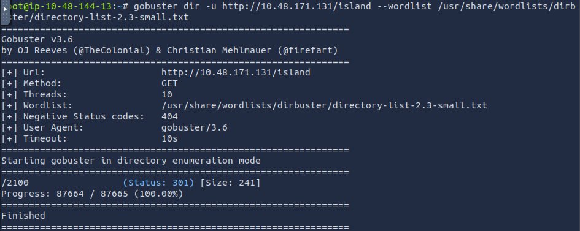

> Found another directory which is /2100 <br>

> Visit http://10.48.171.131/island/2100 <br>

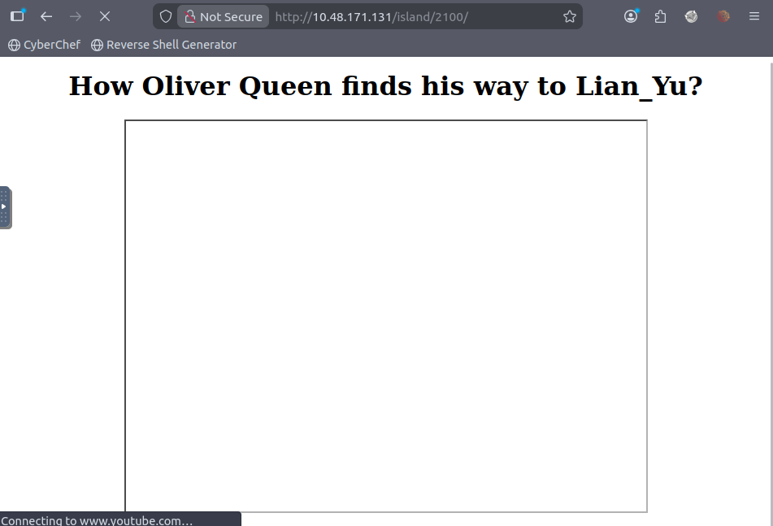

> View the page source. <br>

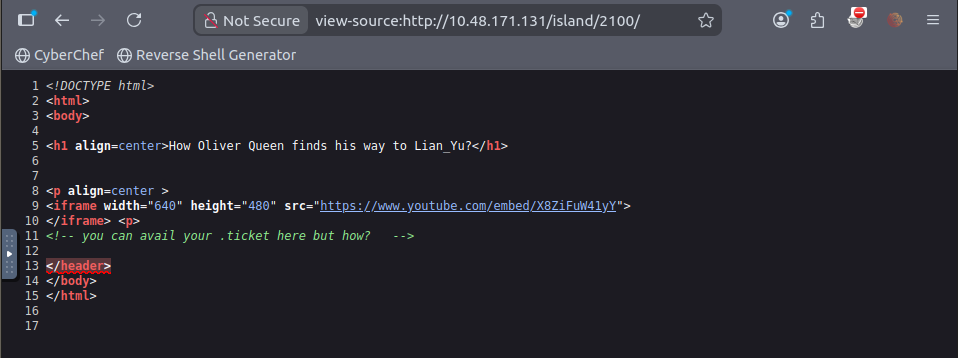

> Discovered a file with .ticket extension. <br>

> Run gobuster again to look for a file with .ticket extension. <br>

```
gobuster dir -u http://10.48.171.131/island --wordlist /usr/share/wordlists/dirbuster/directory-list-lowercase-2.3-small.txt -x ticket
```

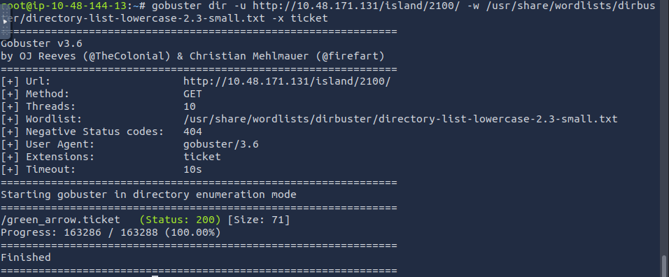

> Found a directory which is /green_arrow.ticket <br>
> Visit http://10.48.171.131/island/2100/green_arrow.ticket/ <br>

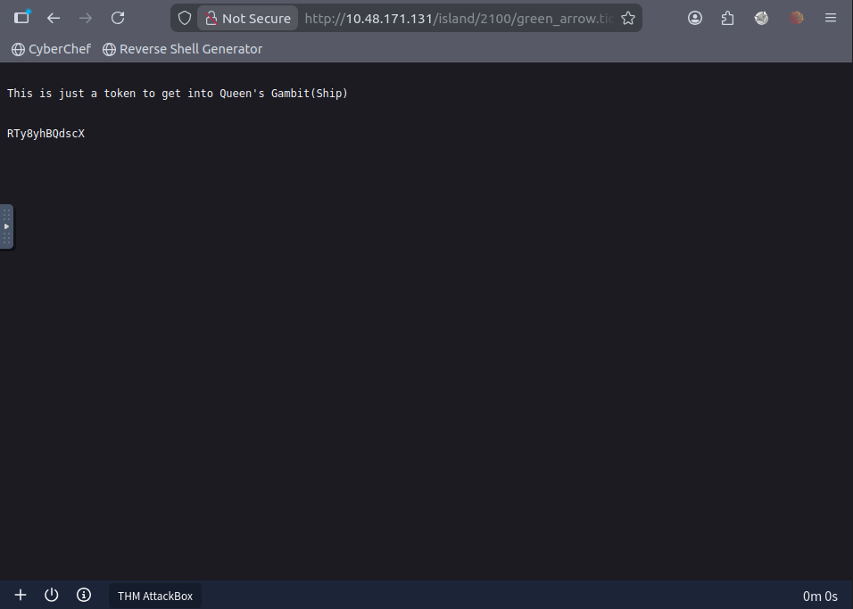

> Discovered an encryption which is RTy8yhBQdscX <br>
> Decode it using CyberChef (use FromBase58) <br>

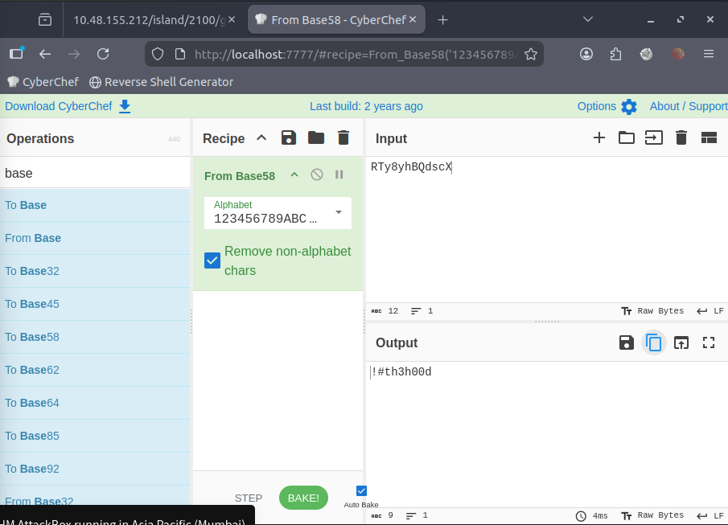

> Retrieved the ftp password which is !th3h00d <br>

### FTP Login

> Login to the ftp service using the username: vigilante and password: !#th3h00d and list all the files using ls <br>
> Found other_user.txt file using ls -la and discovered another user which is slade <br>

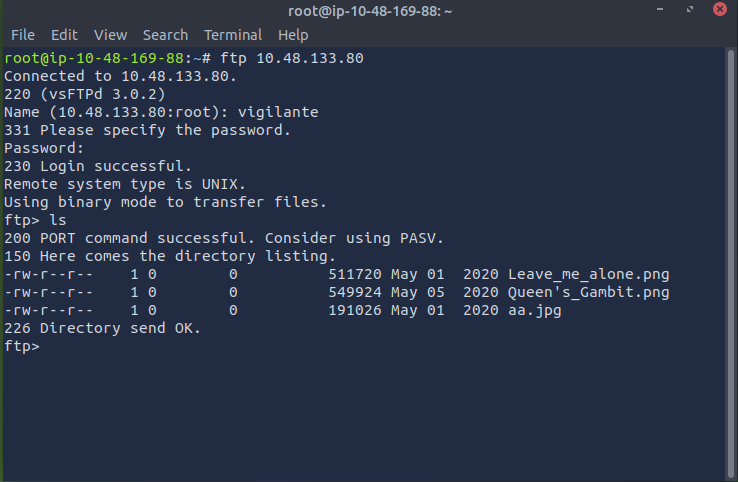

> Found 3 image files in the server and downloaded all the images using mget <br>

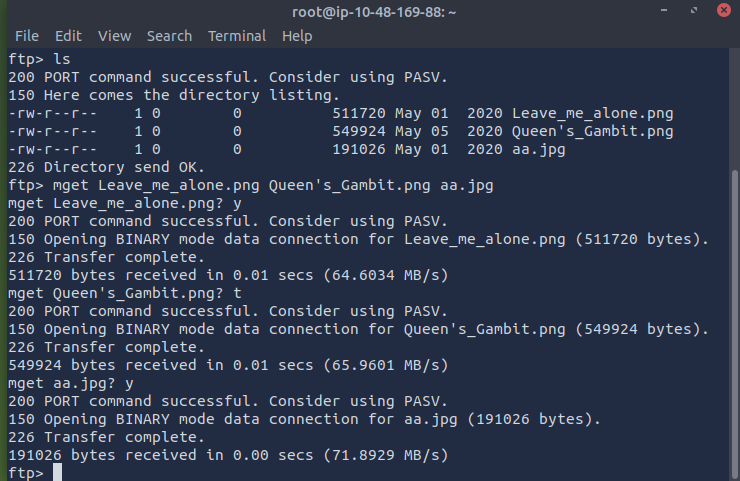

> View all the images and noticed the Leave_me_alone.png cannot be viewed. <br>

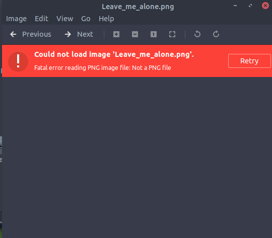

> Use exiftool to view the file header and notice that something is wrong with the file format <br>
> Use the command below to view the file signature <br>

```
xxd Leave_me_alone.png | head
```

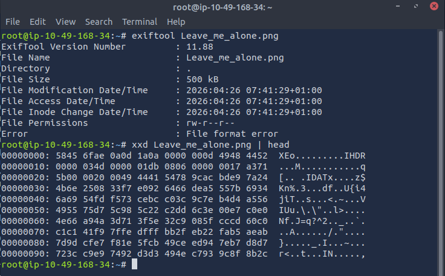

> The file signature does not match the expected header for this file type <br>

> Open CyberChef and fix the error by changing the '58 45 6f ae 0a 0d 1a 0a' to '89 50 4e 47 0a 1a 0a' <br>

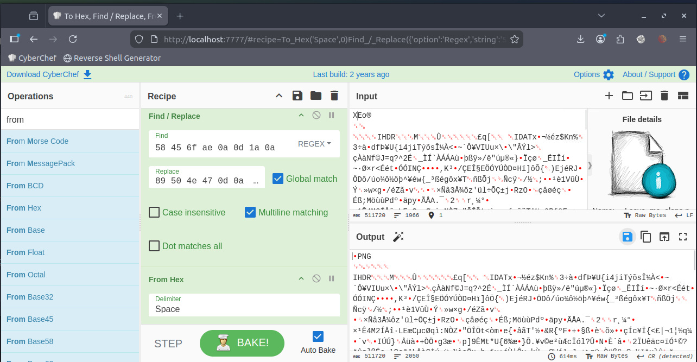

> Save the new .png file <br>

> View the image <br>

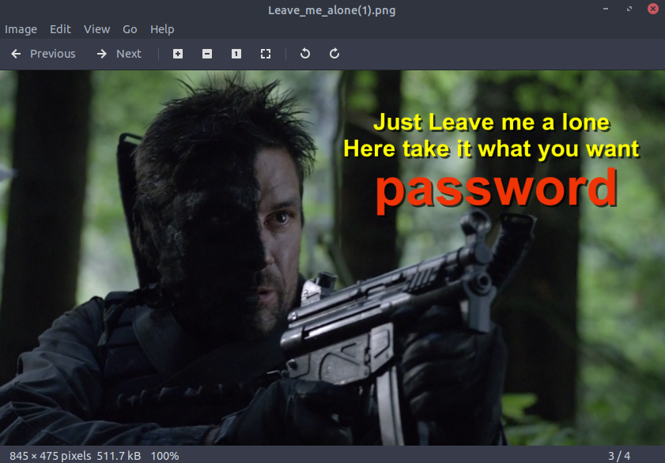

> Discovered a password which is 'password' <br>

> Use the password to extract any hidden file within the other image files using steghide <br>

```
steghide extract -sf aa.jpg
```

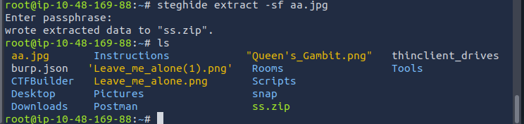

> Successfully extracted from .jpg file to a ss.zip file <br>

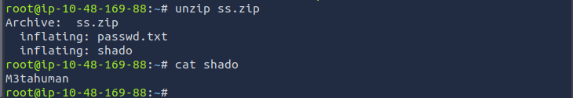

> Found two files which are passwd.txt and shado.txt after unzipping the ss.zip file <br>
> View the shado.txt file and retrieve the ssh password which is 'M3tahuman' <br>

### SSH Login

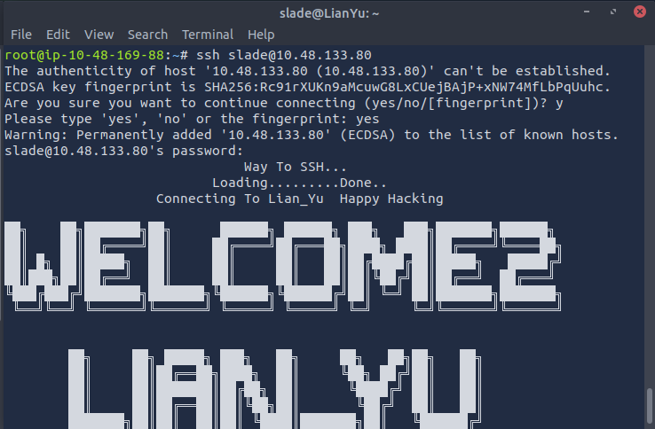

> Login to the ssh server <br>

> View file within the server using ls and view the file using cat<br>

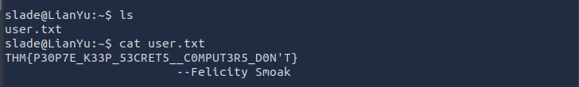

> user.txt was discovered and the flag was found when viewing the user.txt file <br>

### Root Privilege Escalation

> Use sudo -l to find out which commands can be used as the root user <br> 

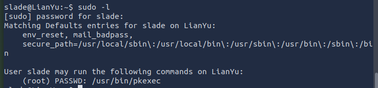

> Discovered /usr/bin/pkexec <br>

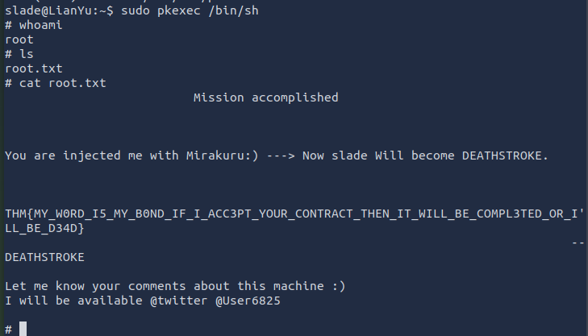

> Use pkexec to execute /bin/sh with root privileges, allowing us to access and retrieve the root flag <br>


